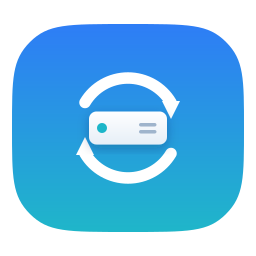
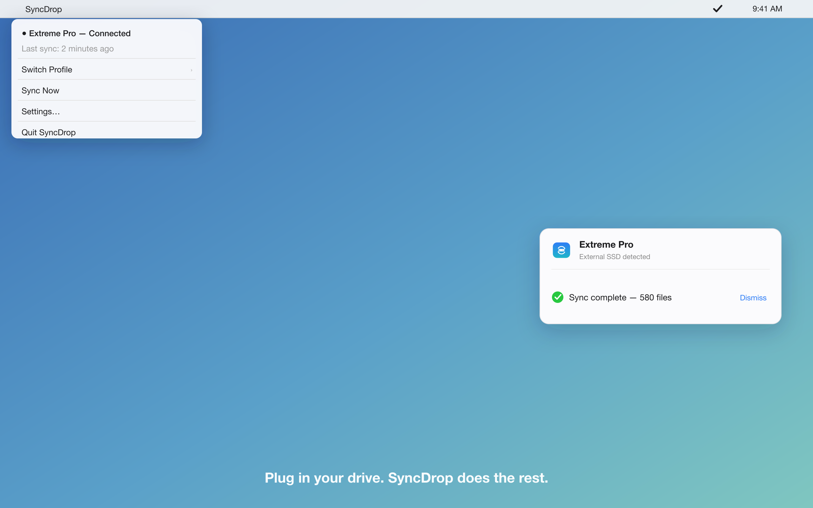
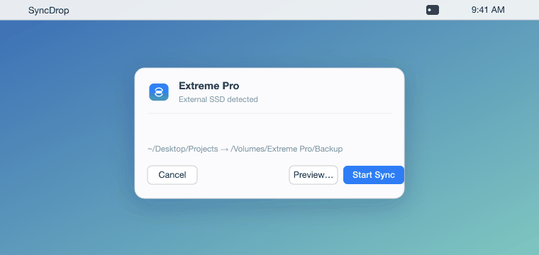
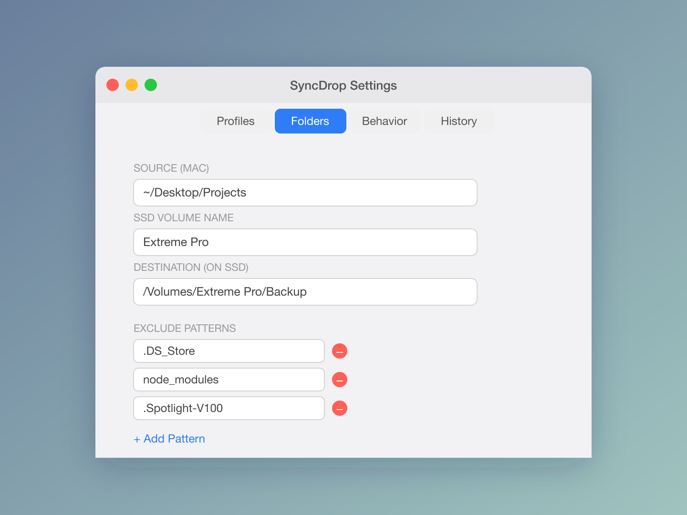

<div align="center">



# SyncDrop

**OneDrive for your own hardware — auto-sync the folders you choose to any drive you plug in, the moment it connects.**

[](https://github.com/abhinay-hat/SyncDrop/releases/latest/download/SyncDrop.zip)
[](LICENSE)
[](#requirements)

<br>



</div>

SyncDrop is a lightweight macOS **menu-bar** app. No dock icon, no window clutter.

Think of it like OneDrive or iCloud Drive — but instead of syncing to a cloud you don't control, it syncs the folders **you** pick to **your own** storage device. Configure your folders once; then whenever you connect the configured drive — an **external SSD, USB pen drive, or hard disk** — SyncDrop automatically mirrors your selected files onto it. Plug in, it syncs, you're backed up. No subscriptions, no cloud, your data stays yours.

<div align="center">



*Plug in your drive → SyncDrop detects it → mirrors your folders → done.*

</div>

---

## Install

### Option A — Download the app (recommended)

1. **[Download `SyncDrop.zip`](https://github.com/abhinay-hat/SyncDrop/releases/latest/download/SyncDrop.zip)** from the latest release.
2. **Unzip** it (double-click) and **drag `SyncDrop.app`** into your `/Applications` folder.
3. **First launch.** Double-click it. macOS shows *"Apple could not verify SyncDrop is free of malware."* That's expected — the app isn't notarized yet (see [below](#why-the-warning)). To open it:

   **On macOS 15 (Sequoia) and later:**
   1. Click **Done** on the dialog.
   2. Open  → **System Settings → Privacy & Security**.
   3. Scroll down to the message *"SyncDrop was blocked…"* and click **Open Anyway**.
   4. Authenticate, then click **Open**. Done — you only do this once.

   **On macOS 13–14 (Ventura/Sonoma):** right-click `SyncDrop.app` → **Open** → **Open**.

   **Or, from Terminal (any version):** one command, then just double-click normally:
   ```bash
   xattr -dr com.apple.quarantine /Applications/SyncDrop.app
   ```
4. The **SyncDrop icon appears in your menu bar**. Click it → **Settings** to set up.

<a name="why-the-warning"></a>
> **Why the warning?** SyncDrop is open-source and code-signed, but not yet *notarized* by Apple — notarization requires a paid Apple Developer account ($99/yr). The build is safe and fully auditable here; you can also [build it yourself](#option-b--build-from-source) in one command. Notarization is on the [roadmap](#roadmap).

### Option B — Build from source

Requires the Swift toolchain (Xcode or Command Line Tools).

```bash
git clone https://github.com/abhinay-hat/SyncDrop.git
cd SyncDrop

make app        # builds a signed SyncDrop.app in the repo root
make install    # builds and copies it to ~/Applications
```

Other targets:

```bash
swift build     # debug build
swift test      # run unit tests (needs full Xcode, not just Command Line Tools)
make clean      # remove build artifacts
```

---

## First-time setup

Open the menu-bar icon → **Settings**, then in the **Folders** tab:

1. **Source (Mac)** — choose the folder you want backed up (e.g. `~/Desktop/Projects`).
2. **SSD Volume Name** — type the exact name of your SSD as it appears in Finder (e.g. `Extreme Pro`).
3. **Destination (on SSD)** — plug in the SSD, then choose the target folder on it.

<div align="center">



</div>

In the **Behavior** tab, turn on **Auto-sync when SSD connected** if you want it to run automatically. That's it — plug in the drive and SyncDrop syncs.

---

## Features

| Feature | What it does |
|---------|--------------|
| **Auto-sync on connect** | Plug in your SSD and the sync starts (opt-in per profile). |
| **Multiple profiles** | Different source/destination/exclude sets, switchable from the menu. |
| **Dry-run preview** | See exactly what will be added, updated, or deleted before committing. |
| **Mirror mode** | Adds `--delete` so the SSD exactly matches the Mac. |
| **Versioned backups** | Overwritten/deleted files are kept under `.syncdrop_archive/<date>` instead of discarded. |
| **Exclude patterns** | rsync glob patterns, with sane macOS defaults (`.DS_Store`, `node_modules`, …). |
| **Auto-eject** | Safely ejects the SSD after a successful sync. |
| **Sync history & notifications** | Recent runs (files, size, duration) and a completion notification. |
| **exFAT-safe** | Avoids permission/ownership flags that break on exFAT; uses `--modify-window=1` for its 2-second timestamp granularity. |

---

## Requirements

- macOS **13 (Ventura)** or later
- `rsync` — ships with macOS at `/usr/bin/rsync`
- (Source builds only) Swift toolchain

---

## How it works

`VolumeMonitor` watches `NSWorkspace` mount/unmount notifications and matches your configured SSD volume name. On connect — with auto-sync enabled — `SyncEngine` launches `rsync` with a per-profile argument list, streams progress from stdout, and reports state through Combine to the menu-bar UI. Profiles, settings, and history persist in `UserDefaults` via `ConfigStore`.

---

## Project layout

```
Sources/
  SyncDropCore/    # rsync engine, volume monitor, config, models (no UI)
  SyncDrop/        # AppKit + SwiftUI menu-bar app
Tests/             # XCTest unit tests for the core
android/           # Android port (work in progress)
Resources/         # app icon (.svg source + .icns)
```

---

## Roadmap

SyncDrop today is macOS → local drive. The goal is **sync the folders you choose to any storage you own, from any device.** Planned:

- **NAS / network drives** — sync to a NAS or any mounted network share, not just USB-attached drives.
- **Android app** — sync from your phone to a USB-OTG SSD/pen drive (in progress under [`android/`](android/)).
- **Windows app** — the same plug-in-and-sync experience on Windows.
- **More targets** — any drive type macOS/Windows can mount (SSD, pen drive, HDD, SD card).

Have a use case or want to help build one of these? Open an issue.

## Android (in progress)

An Android port (Kotlin + Jetpack Compose) targeting USB-OTG drive sync is in early development under [`android/`](android/).

---

## Contributing

Issues and pull requests welcome. Build with `make app`, run `swift test` before submitting.

### Releasing (maintainers)

```bash
make app        # ad-hoc signed bundle, hardened runtime (notarization-ready)
make zip        # clean, AppleDouble-free SyncDrop.zip for distribution
```

To ship a **notarized** build (no Gatekeeper warning for users), you need a paid
Apple Developer account, then:

```bash
export APP_IDENTITY="Developer ID Application: Your Name (TEAMID)"
export APP_STORE_CONNECT_KEY_ID=...        # App Store Connect API key id
export APP_STORE_CONNECT_ISSUER_ID=...     # issuer id
export APP_STORE_CONNECT_API_KEY_P8="$(cat AuthKey_XXXX.p8)"
make notarize   # builds, signs with Developer ID, notarizes, staples, zips
```

See [`Scripts/sign-and-notarize.sh`](Scripts/sign-and-notarize.sh).

#### Automated releases (GitHub Actions)

Pushing a `v*` tag triggers [`.github/workflows/release.yml`](.github/workflows/release.yml),
which builds, packages, and attaches `SyncDrop.zip` to a GitHub Release:

```bash
git tag v1.0.1 && git push origin v1.0.1
```

If these repo **secrets** are set, the workflow signs with Developer ID and
notarizes; otherwise it falls back to a clean ad-hoc build (still uploaded):

| Secret | What |
|--------|------|
| `APP_IDENTITY` | `Developer ID Application: Your Name (TEAMID)` |
| `MACOS_CERTIFICATE_P12_BASE64` | Developer ID cert exported as `.p12`, base64-encoded |
| `MACOS_CERTIFICATE_PASSWORD` | password for that `.p12` |
| `APP_STORE_CONNECT_KEY_ID` | App Store Connect API key id |
| `APP_STORE_CONNECT_ISSUER_ID` | issuer id |
| `APP_STORE_CONNECT_API_KEY_P8` | contents of the `AuthKey_XXXX.p8` |

## License

[MIT](LICENSE) © 2026 Abhinay Reddy
